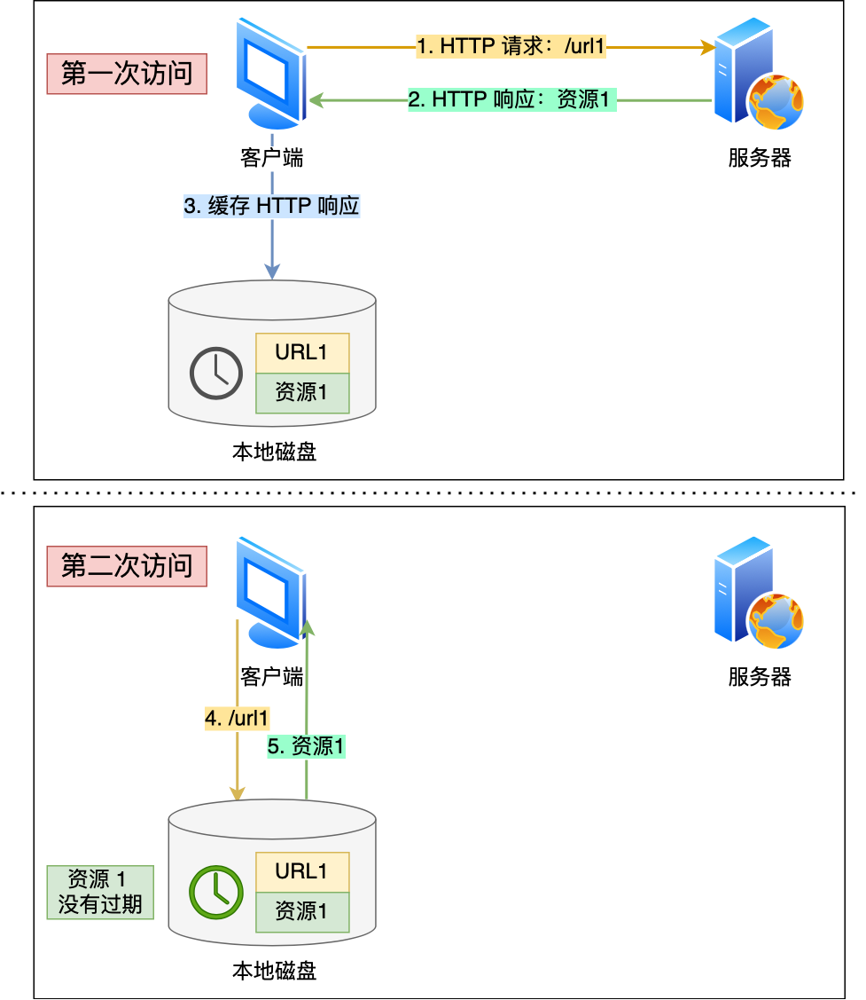
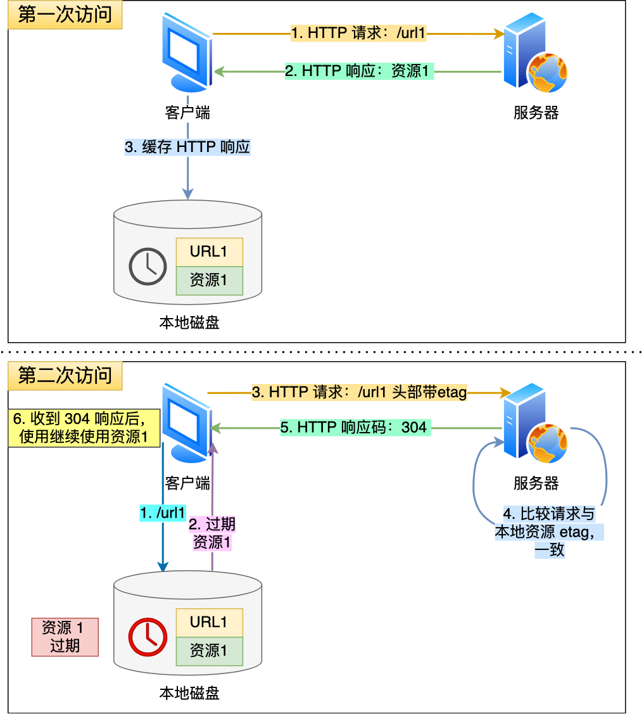
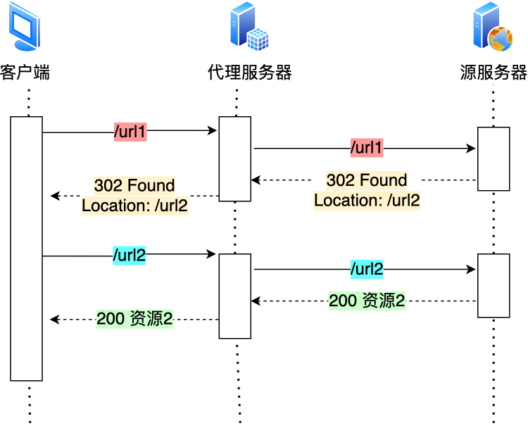
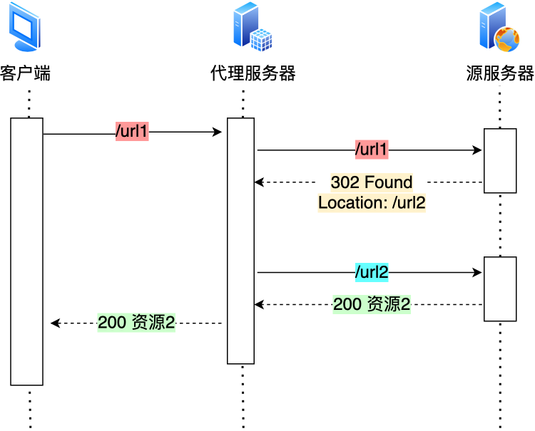
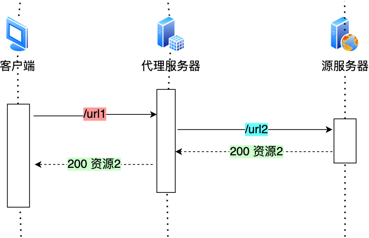
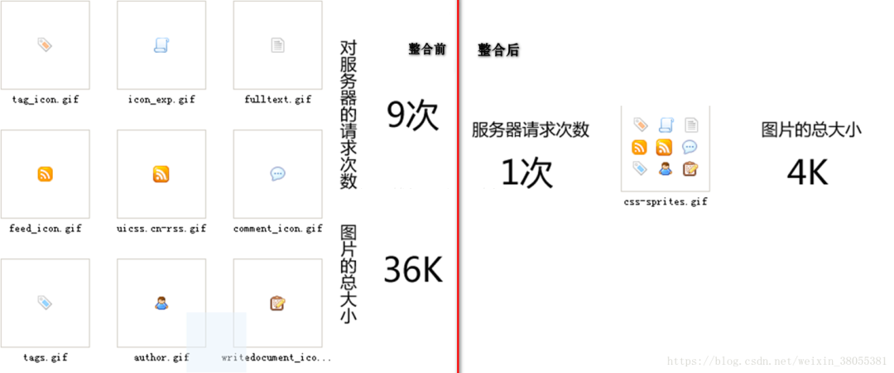

# HTTP （Hypertext Transfer Protocol）

## Status Code

***

- 2XX 表示成功

	- 200 OK 							表示请求成功。
	- 201 Created 						表示请求被创建完成，同时新的资源被创建。
	- 202 Accepted						表示请求已被接受，但是处理未完成。

- 3XX 表示重定向

	- 300 Mutiple Choices				表示多重选择。
	- 301 Moved Permanently				表示永久重定向。
	- 302 Found							表示临时重定向。

- 4XX 表示客户端错误
	
	- 400 Bad Request					表示服务器未能理解请求。
	- 401 Unauthorized					表示被请求页面需要认证。
	- 403 Forbidden						表示服务器拒绝执行请求。
	- 405 Method Not Allowed			表示客户端请求的方法被禁止。
	- 408 Request Time-out				表示请求超时。

- 5XX 表示服务器错误

	- 500 Internal Server Error			表示服务器内部错误。
	- 501 Not Implement 				表示服务器不支持所请求的功能。
	- 502 Bad Gateway
	- 503 Service Unavailable			表示服务不可用。
	- 504 Gateway Time-out				表示网关超时。 

## 优化HTTP/1.1

***

- 使用KeepAlive将HTTP/1.1从短连接改成长连接。
	- 从底层传输层方向入手，减少TCP连接建立和断开的次数，来减少网络延迟，提高HTTP/1.1协议的传输效率。

### 三种优化思路

*** 

- 尽量避免发送HTTP请求；

	- 通过缓存技术
		- 客户端会把第一次请求以及响应的数据保存在本地磁盘中，其中将请求的URL作为Key，而相应作为Value，两者形成映射关系。这样当后续发起相同的请求时，就可以先在本地磁盘上通过Key查到对应的Value，也就是响应。如果找到了，就直接从本地直接读取响应，毋庸置疑，读取本地磁盘的速度肯定比网络请求快得多。
	
			

		- 如果响应不是最新的，而客户端却不知情。所以服务器在发送HTTP响应时，会估算一个过期时间，并把这个信息放在响应头部中，这样客户端在查看响应头部信息时，一旦发现缓存的响应是过期的，则会重新发送网络请求。

		- 如果客户端从第一次请求得到的响应头部中发现了该响应过期了，客户端重新发送请求，在请求的Etag头部带上第一次请求的响应头部的摘要。这个摘要是唯一标识响应的资源，当服务器收到请求时后，会将本地资源的摘要与请求中的摘要做比较。如果不同，那么说明客户端的缓存已经没有价值，服务器在响应中带上最新的资源。如果相同，说明客户端的缓存还是可以继续使用的，那么服务器仅返回不含有包体的304 Not Modified响应，告诉客户端仍然有效，这样就可以减少相应资源在网络中传输的延时。

			

- 在需要发送HTTP请求时，考虑如何减少请求的次数；

	- 减少重定向的次数

		服务器上的一个资源可能由于迁移、维护等原因从url1移至url2后，而客户端不知情，它还是继续请求url1，这时服务器不能粗暴地返回错误，而是通过302响应码和Location头部，告诉客户端该资源已经迁移至url2了，于是客户端需要再发送url2请求以获得服务器的资源。那么，如果重定向请求越多，那么客户端就要多次发起HTTP请求，每一次的HTTP请求都得经过网络，这无疑会降低网络性能。
		
		另外，服务器这一方往往不只有一台服务器，比如源服务器上一级是代理服务器，然后代理服务器才与客户端通信，这时客户端重定向就会导致客户端与代理服务器之间需要2次消息传递。
		 
		

		 
		如果重定向的工作由代理服务器完成，就能减少HTTP请求次数了。
		 
		 
		
		

		而且当代理服务器知晓了重定向规则后，可以进一步减少消息传递次数。
		 

		

	- 合并请求

		如果把多个访问小文件的请求合并成一个大的请求，虽然传输的总资源还是一样，但是减少请求，也就意味着减少了重复发送的HTTP头部。

		另外，由于HTTP/1.1是请求响应模型，如果第一个发送的请求，未收到对方的响应，那么后续的请求就不会发送，于是，为了防止单个请求的阻塞，所以一般浏览器会同时发起多个请求，每一个请求都是不同的TCP连接，那么，如果合并了请求，也就会减少TCP连接的数量，因而省去了TCP握手和慢启动过程耗费的时间。

		接下来，具体看看合并请求的几种方式。

		-  有的网页会含有很多小图片、小图标，有多少个小图片，客户端就要发起多少次请求。那么对于这些小图片，我们可以考虑使用CSS image Sprites技术把它们合成一个大图片，这样浏览器就可以用一次请求获得一个大图片，然后再根据CSS数据把大图片分割成多张小图片。

			

		- 除了将小图片合并成大图片的方式，还有服务端使用webpack等打包工具将js、css等资源合并打包成大文件，也是能达到类似的效果。

		- 另外，还可以将图片的二进制数据用base64编码后，以url的形式嵌入到html文件，跟随html文件一并发送。这样客户端收到html文件后，就可以直接解码出数据，然后直接显示图片，就不用再发起图片相关的请求，这样便减少了请求的次数。

		可以看到，合并请求的方式就是合并资源，以一个大资源的请求替换多个小资源的请求。

		但是，这样的合并请求会带来新的问题，当大资源中的某一个小资源发生变化时，客户端必须重新下载整个完整的大资源文件，这显然带来了额外的网络消耗。

	- 延迟发送请求

		请求网页的时候，没必要把全部的资源都获取到，而是只获取当前用户所看到的页面资源，当用户向下滑动页面的时候，再向服务器获取接下来的资源，这样就达到了延迟发送请求的效果。

- 减少服务器的HTTP相应的数据大小

	对于HTTP的请求和响应，通常HTTP的响应的数据大小会比较大，也就是服务器返回的资源会比较大。

	于是，我们可以考虑对响应的资源进行压缩，这样就可以减少响应的数据大小，从而提高网络传输的效率。

	压缩的方式一般分为两种，分别是无损压缩和有损压缩。

	- 无损压缩

		是指资源经过压缩后，信息不被破坏，还能完全恢复到压缩前的原样，适合用在文本文件、程序可执行文件、程序源代码。

		无损压缩，需要对原始资源建立统计模型，利用这个统计模型，将常出现的数据用比较短的二进制比特序列表示，将不常出现的数据使用较长的二进制比特序列表示，生成二进制比特序列一般是霍夫曼编码算法。

		gzip就是比较常见的无损压缩，客户端支持的压缩算法，会在HTTP请求中通过头部中的Accept-Encoding字段告诉服务器：

		`Accept-Encoding : gzip, deflate, br`

		服务器收到后，会从中选择一个服务器支持的或者合适的压缩算法，然后使用此压缩算法对响应资源进行压缩，最后，通过响应头部的content-encoding字段告诉客户端该资源使用的压缩算法。

		`content-encoding: gzip`

		gzip的压缩效率不如Google推出的Brotli，也就是上文的br，所以，如果可以的话，服务器应该选择压缩效率更高的br算法。

	- 有损压缩

		主要将次要的数据舍弃，牺牲一些质量来减少数据量、提高压缩比，这种方法经常用于压缩多媒体数据，比如音频、视频、图片。

		可以通过HTTP请求头部中的Accept字段里的q质量因子，告诉服务器期望的资源质量。

		`Accept : audio/*; q=0.2, audio/basic`

		关于图片的压缩，目前压缩效率比较高的是Google推出的WebP格式。

		相同图片质量下，WebP格式的图片大小都比Png格式的图片小。所以对于大量图片的网站，可以考虑使用WebP格式的图片，这将大幅提升网络传输的性能。

